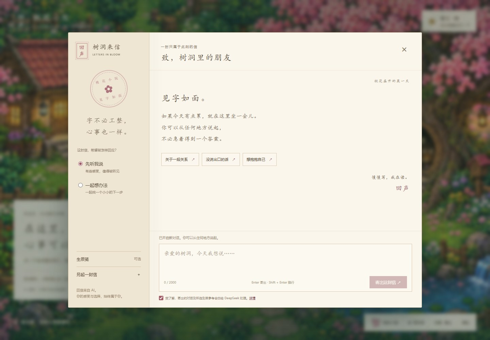

# 回声 · 桃花小院

像素小院里的书信式 AI 情感树洞：变成一只小猫，走进桃树，把心事写成信。先在 localhost 开发，准备好再上线。原生 Node.js 22+ 服务，面向 2 核 2 GB 服务器的小规模试用；尚未做云端压力测试。




[产品意图与后续阶段](docs/PRODUCT.md) · [资料与技能筛选](docs/RESEARCH.md) · [视觉素材记录](docs/ART.md)

## 已实现

- 原创桃花小院场景，直接点击右侧桃树内部的洞口进入书信聊天；小猫可自定义毛色、有六帧跑步跟随动画，支持鼠标/触摸拖动，拖进洞口也能进入。花瓣可关闭，适配小屏幕与减少动态效果。
- 固定两阶段 Agent：最多一批三个只读工具，至多两次模型请求，没有 Agent 循环或子 Agent。支持资料卡检索、自助练习、确定性排盘读取。
- 七张带出处的本地知识卡，分别来自 WHO / NHS 指南与传统文化文献；回信显示实际检索到的来源。没有冒充全文 RAG 或心理诊疗系统。

- 多轮对话，倾听 / 建议两种模式；错误、等待、停止和新对话状态。
- DeepSeek 服务端调用（默认 `deepseek-flash`，关闭思考模式），API Key 不进入前端。
- 可选本人和对方生日，使用 `lunar-javascript` 排出参考干支。按北京时间、公历、午夜换日；没有出生地真太阳时转换。未知时辰不补造时柱，节气当天的年月柱有不确定性。
- 本站不持久保存对话和生日，浏览器只存猫咪颜色和动效偏好，不加载第三方统计或外部字体。刷新或新对话会丢失当前内容。发送时交给 DeepSeek 的内容受服务商自身政策约束。
- 每次用户输入 2000 字、最多最近 10 轮上下文、总上下文 20000 字、默认输出上限 800 token。每封信最多消耗两次模型请求；每天默认全站 100 封信、单连接来源 30 封信，重启不会清空当天次数；失败请求也计入额度，防止重试绕过费用限制。
- 本地运行和可选的非 root 云端系统服务；当前开发流程不会自动部署。

## 本地运行

```powershell
npm.cmd ci
npm.cmd run dev
```

打开 http://127.0.0.1:3180 。后端运行在自己的电脑上，模型仍通过 DeepSeek API 调用。开发模式会在源文件变更后重启服务，刷新浏览器即可查看前端修改。

配置文件优先使用 `ENV_FILE` 指定路径，其次读取项目 `.env`，最后读取用户目录的 `.config/shudong/.env`（Windows：`%USERPROFILE%\.config\shudong\.env`）。复制 `.env.example` 到自己的配置文件后填写密钥，**不要在 `.env.example` 里填写真实密钥**。外部配置修改后需重启服务。所有真实 `.env` 文件均不提交。

## GitHub 与日常迭代

每完成一个可用的小功能，提交一个有说明的 commit，再推送到 GitHub。仓库保存源代码和版本历史；README、测试与功能演示可以一起展示项目经历。

```sh
git add .
git commit -m "Describe the completed change"
git push
```

推送会运行 GitHub Actions 的语法和接口测试，不调用付费模型，也不连接云服务器。当前没有自动部署工作流，待决定上线时再添加。

真实 API Key、SSH 私钥、服务器连接信息、个人聊天与原始需求文档均不纳入仓库。

## 可选：准备好后部署到云端

将 `deploy/config.example.json` 的格式复制到用户目录 `.config/shudong/deploy.json`，填入自己的连接信息。部署脚本需要能安装系统服务的管理账号。连接配置保存在仓库之外。

```powershell
python deploy/deploy.py
powershell -ExecutionPolicy Bypass -File deploy/start-preview.ps1
```

部署脚本通过现有专用 SSH 密钥和已核对的主机指纹连接服务器；仅打包明确列出的源文件和运行时依赖，不上传需求文档、测试记录和私人经历。首次部署下载 Node.js 22 官方 Linux 包并核对官方 SHA256。

服务器路径 `/opt/shudong/app`，密钥配置 `/etc/shudong.env`（仅 root 可读），服务 `shudong.service`，以 `shudong` 系统用户运行。计数保存在 `data/quota.json`，内容只有日期、计数及每日更换盐的连接地址散列，不含对话。

隧道启动后访问 http://127.0.0.1:3180 。这会访问远程服务器。隧道和本地开发使用相同本机端口，需要先关闭本地开发再启动隧道。关闭隧道不停止服务器。云端监听 3080，无需开放额外的公网端口。

## 测试

```powershell
npm.cmd run check
npm.cmd test
# 对运行中的本地测试实例做浏览器验证（使用已安装的 Microsoft Edge）
$env:TEST_URL = 'http://127.0.0.1:3180'
node test/browser.mjs
node test/garden.mjs
```

单元/接口测试使用本地模拟模型，验证输入校验、真实历法样例、缺失时辰、密钥不泄露、跨来源请求阻止、不写入对话和重启后的限流。浏览器测试模拟聊天 API，覆盖桌面/手机、猫咪偏好、树洞入口、信纸、同意后发送、生辰、清除、资料架和隐私说明。工具测试覆盖参数、未授权生辰访问、检索无命中、两次请求封顶及实际来源。`node test/live-browser.mjs` 会发送一条不含个人信息的合成消息，调用真实付费模型，验证检索与练习工具；日常 CI 不运行它。

## 当前边界

- 当前场景是整体背景与交互热点，房屋、种植和宠物养成还没有玩法。
- 知识库是七张人工整理的短卡，不是心理学或命理完整语料库；没有在线搜索、向量数据库和咨询资质。

- 这是私人试用版，没有开放公众注册，没有 Ollama 或多模型切换，不是完整合婚/大运预测服务。
- 公网发布前须落实域名、HTTPS、适用的备案、访问控制及滥用防护。当前限流按实际连接来源计算，不信任转发头；日后增加反向代理需设计可信来源策略。
- 调用次数上限不是精确人民币预算；模型费用以 DeepSeek 账单为准。远程模型无法保证仅在本地处理数据。
- 本地代码不保存对话，但不等于用户截图、操作系统、代理或模型服务商没有记录；不承诺删除模型服务商已收到的信息。
- WebMCP 草稿工具仅在浏览器支持时注册，只填写草稿，不自动发送。尚未在原生 WebMCP 浏览器验证。

## 官方参考

- DeepSeek API：https://api-docs.deepseek.com/
- 历法库：https://github.com/6tail/lunar-javascript （MIT，依赖保留原许可证）
